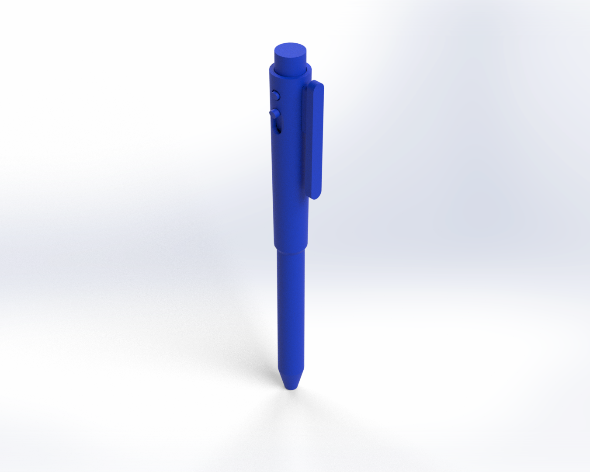

# My 3D-Printable Pen


## Introduction

Welcome to my repository for my 3D-Printable Pen project.

<div>
    
</div>

## Motivation

I started this project because I enjoy writing with pens and wanted to see if a pen could be 3D-printed using sustainable materials, e.g., a bio-degradable resin, which could be recycled easily.

## Aims

The aims of this project included:
- Developing a 3D-printable pen that could be recycled easily.

## Objectives

The objectives of this project included:
- Creating accessible Computer Aided Design (CAD) files.
- Writing using the 3D-printed pen.
- Recycling the 3D-printed pen.

## Repository Structure

The repository is organised as follows:

```console
/pen         
    /cad                          
        /solidworks                    
        /freecad  
        /fabrication
        /renders                     
```

All CAD files can be found in the `/cad` sub-directory. I've included the original SOLIDWORKS files and the open-source equivalents.

## Tools Used

I used the following tools in this project:
- SOLIDWORKS and FreeCAD.

Get FreeCAD here: https://www.freecadweb.org/.  

## Credit

Dr Frazer K. Noble  
http://drfknoble.com